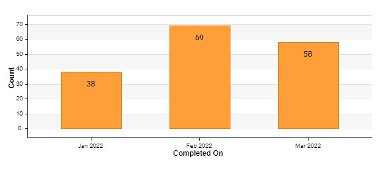

# Help Desk Tickets

Current Trend (Mar 1^st^ -- Current): 58 cases (Open & Closed)

**Weekly trend for Mar is approximately 28 cases per week (up 14
compared to 2021)**

{width="6.4625in" height="2.98125in"}Monthly
trend for 2021: approx. 54 cases per month (down 19 cases per month
compared to 2021)

Current Open tickets: 26

Oldest Ticket in queue is 515065 opened 12/28/21 \|Title: Test Cert ...

Tasks Assigned for Integration Team from Aug 1st to current in HEAT
systems.

  -----------------------------------------------------------------------
  Category                                 No of Tickets
  ---------------------------------------- ------------------------------
  ACCESS                                   2

  APPLICATION ERROR                        1

  CLAIM STATUS                             6

  CONNECTION ISSUE                         1

  DOCUMENTATION                            3

  ERROR                                    5

  FORM STATUS                              1

  GENERAL QUESTIONS                        2

  INSTALLATION CERTIFICATE                 4

  MEMBER AUTHORIZATION                     1

  PRM DATA                                 1

  **Grand Total**                          **27**
  -----------------------------------------------------------------------

Attached is the full summary.


Salesforce Cases: 1

{width="6.5in" height="1.0291666666666666in"}

{width="4.5in" height="2.2604166666666665in"}

# Maintenance & Operations 

**Maintenance -- No current projects/modifications needed as part of
maintenance**

**Operations**

**Service Request #TBD**

**NAPPA Service Modification**

-   Changes are required to address additional fields (DEALicenseNumber,
    > DEAExpirationDate) requested by stakeholders.

-   Additional fields must be added in order to complete EDI 274 testing
    > with state.

**Project -- Active (EPSDT Dynamics/Service Integration)**

-   Team currently working with DMBI to migrate data to target
    environments by deployment dates. See Release Schedule portion of
    BOB for deployment dates.

Currently Active Projects

**Project -- Active (LA County Healthcare Information Data Exchange --
HIDEx) -- Priority 1**

-   Microsoft team currently implementing baseline infrastructure to
    publish FHIR server and services

-   DMH provided security roles and memberships for subscriptions and
    RBAC access

-   DMH submitted requests for 9 subscriptions needed for HIDEx

-   Team working on publishing release via DevOps

-   Team documented requirements and ported to LA County instance of
    Azure DevOps

-   Microsoft onboarded two additional resources Paul Wu, Luis Fontanez

-   Microsoft team still missing two resources and runs risk of not
    meeting timeline due to lack of staffing

-   ~~Team was on hiatus due to holidays in late 2021~~

-   ~~Working internally to determined isolation, data, and privacy
    requirements~~

-   ~~Met with new Microsoft Architect Mustafa Al-Durra~~

-   ~~Confirmed new Architecture on 9/22/2021~~

-   ~~Requested diagrams from Microsoft on 9/24/2021~~

-   ~~Meetings planned for last week of Sept to begin planning of Sprint
    0.~~

-   ~~Scheduling sprint 0 activities and identifying resources~~

-   ~~Held meeting with Microsoft to discussion team activities,
    scheduling, and communication plan~~

-   

-   ~~Scheduling meeting with ISD to prepare Azure subscriptions~~

-   ~~Reference Architecture has been set and decided. Departments will
    share logical orchestration and separate functional storage.~~

-   ~~Inquiring with Microsoft next steps to begin Sprint 0~~

**Project -- Active (Netsmart -- FHIR Implementation) -- Priority 2**

-   Currently reviewing Change Notices to review, validate and include
    applicable logic from prior changes to Avatar Services

-   Currently meeting with Netsmart on weekly basis to review GAP
    analysis documents

-   ~~Began planning with Netsmart in late August.~~

-   ~~Met on 9/22/2021 for FHIR, Auth token, and demo~~

-   ~~Planning and scheduling the following sessions with Netsmart~~

    -   ~~Architectural and Workflow Discovery Planning Sessions~~

        -   ~~Four 3-4 hour sessions~~

    -   ~~Architecture and Workflow Focus Planning Sessions~~

        -   ~~Four 5 hour sessions~~

    -   ~~Quarterly FHIR Technical Support Sessions~~

        -   ~~Six 1-day (6 hours per session) per quarter~~

-   ~~Team is reviewing implementation guide provided by Netsmart~~

-   ~~ETA for feedback is week of 10/18/21~~

-   ~~Next session with Netsmart scheduled for Oct 27, 2021~~

-   ~~Working on finalizing GAP analysis for stakeholder review~~

-   ~~Gap analysis complete, will send to stakeholders for feedback~~

**Project -- Active (NACT EDI Integration) -- Priority 3**

-   Team is currently working on producing a test file for submission to
    DHCS

-   Access to state Sharepoint site is still pending

-   Requested XML validation response from State on 2/5/22. DHCS
    provided on 2/7/22

-   Met with DHCS on 2/4/22

-   ~~Project officially began 8/30/2021~~

-   ~~274 TR3 was not licensed by Department~~

-   ~~Worked with Administration to rush payment of invoice~~

-   ~~Invoice had been pending payment since September of 2020~~

-   ~~Received licensed TR3 on 9/24/21~~

-   ~~Design session scheduled 10/14/21~~

-   ~~Currently working on mapping dynamics entities to 274~~

-   ~~Developing logic app to build message and map to 274 schema~~

-   ~~Team had issue locating schema for state 274~~

-   ~~Team was able to resolve and is continuing to work on building 274
    message~~

-   ~~Team is currently mapping the 274 transaction~~

-   ~~At least 10 fields have been identified that are not captured in
    the source~~

-   ~~Development continues to build out the transaction as elements are
    mapped~~

-   ~~ETA for test file is mid-late January~~

# Special Support 

**[In Progress]{.smallcaps}**

**Provider Merger - Active (Prime Health Care & St. Francis) -- Priority
6**

-   P-Auths generated on 10/18/21

-   Working with AppDev to on automated practitioner association
    solution

-   Team provisioned access to Prime Health & St. Francia as follows:

    -   Test certificate issued 12/28/2021

    -   Certification scripts completed on 2/10/2022

    -   Prime Health production cert issued 3/3/2022

    -   St. Francis production cert issued 10/5/2020 (expires 10/5/2022

    -   Ticket 404784 details onboarding handoffs:

> {width="6.5in" height="1.9465277777777779in"}

-   Meeting held on 3/8/2022 with Welligent regarding entity merger

**Program Implementation - Active (STARS Behavioral Health/CRTP) --
Priority 7**

-   Met with Ken Burnett, Jim Wallace, Daniel Navasartian and William
    Hubbard to discuss CRTP configuration

-   CRTP program will leverage 24Hr admissions. Program will span
    multiple legal entities. 24Hr admissions will be submitted under the
    overarching legal entity

-   Will G. (Revenue Systems) and Giri P (Enterprise App) provided
    insight on billing and program config

-   Two new LE's will be forming under contract -- Central Stars, Valley
    Stars will need new certs once DUNS is established.

**Private Insurance Billing Implementation -- Active -- Priority 8**

-   Provided ACH ACCL form detailing contacts for DMH on 2/27/22, TTC
    confirmed receipt on 2/17/22

-   TTC forwarded ACCL request to Bank of America on 3/15/22

-   TTC is currently working on scripts to facilitate transfer from Bank
    of America.

**ECM Data Exchange Implementation - Active -- Priority 9**

-   Continuing to meet and discuss ECM/ILOS service implementation with
    LACare

-   Per Yvette Willock data exchanges must be established with the
    following Health Plans:

    -   L.A. Care

    -   Health Net

    -   Anthem

    -   Blue Shield of California, Promise Health Plan

    -   Molina

-   Working with Project Management to document the program and project
    requests

**In Queue**

**In Analysis**

-   Enterprise Service Bus -- Juan F.

    -   Access to Care (MicroSvc) -- Moh

    -   SRTS -- CSI Integration -- Zak

    -   Potential Client (MicroSvc) -- Zak

-   Noridian (Fed 837) Automation -- Mohammed

-   Update Client Push (Race/Ethnicity) -- Zak

-   Day Treatment Authorization Service -- Philip

-   Appointment/Referral -- TBD

-   270/271 Real Time Medical Eligibility -- Philip

**Approved Projects - Not started**

-   BizTalk Health Check Remediation -- TBD

# Integration Release Schedule: 

EPSDT: TST: February 25th, 2022 / QA: April 27th, 2022 / PROD: May 11th,
2022

Scriptlink: SBOX: February 22, 2021 / PROD: TBD

**LE Onboarding Status** 

+------+-----------+---------+---------------------+-----------------+
| **LE | **LE      | **      | **Status  **        | **Comments **   |
| N    | Name **   | Service |                     |                 |
| umbe |           | Type ** | ** **               | ** **           |
| r ** |           |         |                     |                 |
+======+===========+=========+=====================+=================+
| *    | P         | UCC     | PFAR Started:       | Live            |
| *158 | rovidence |         | 1/22/19             | w/claiming,     |
| 0 ** | Little    |         |                     | still working   |
|      | Company   |         | PFAR Completed:     | on web service  |
|      | of Mary   |         | 06/25/19            |                 |
|      |           |         |                     |                 |
|      |           |         | TPA Notified:       |                 |
|      |           |         | 2/11/19             | **No changes    |
|      |           |         |                     | since August    |
|      |           |         | TPA Completed:      | 2019.**         |
|      | Vendor:   |         | 8/15/19             |                 |
|      | Claim:    |         |                     |                 |
|      | Clearing  |         | Web Serv. Cert.     |                 |
|      | house     |         | Notified: 2/13/19   | Provider/Vendor |
|      | SSI,      |         |                     | actively        |
|      |           |         | Web Serv. Cert.     | developing      |
|      | EHR :     |         | Compltd: 3/19/19    | interface,      |
|      | EPIC      |         |                     | continues to    |
|      |           |         | Claim Cert.         | work on         |
|      |           |         | Notified: 2/11/19   | interface as of |
|      |           |         |                     | 6/25/20         |
|      |           |         | Claim Cert.         |                 |
|      |           |         | Completed: 2/11/19  |                 |
|      |           |         |                     |                 |
|      |           |         | Production Cert     | Using           |
|      |           |         | Issued: 2/11/19     | providerConnect |
|      |           |         |                     | for now         |
|      |           |         | Go Live Date:       |                 |
|      |           |         | 08/01/2019          |                 |
|      |           |         |                     |                 |
|      |           |         |                     | 11/18 - Last    |
|      |           |         |                     | claim was       |
|      |           |         | Test certificate    | 11/16           |
|      |           |         | was installed on    |                 |
|      |           |         | 6/18/19             |                 |
|      |           |         |                     |                 |
|      |           |         | Production          |                 |
|      |           |         | certificate was     |                 |
|      |           |         | installed on        |                 |
|      |           |         | 8/9/19              |                 |
|      |           |         |                     |                 |
|      |           |         |                     |                 |
+------+-----------+---------+---------------------+-----------------+
| *    | LA Center | Outp    | PFAR Started:       | PFAR processing |
| *213 | For       | atient/ | 2/14/2018           | as of 1/5/21.   |
| 0 ** | Alcohol   | Resid   |                     | Pending PRR as  |
|      | And Drug  | ential  | PFAR Completed:     | of 5/18.        |
|      | Abuse     |         |                     |                 |
|      |           |         | TPA Notified:       |                 |
|      |           |         |                     |                 |
|      |           | **      | TPA Completed:      | 9/20 -- **PRR   |
|      | Program:  | CRTP**  |                     | has not been    |
|      | SAFE      |         | Web Service Cert.   | resolved** yet  |
|      | HAVEN     |         | Notified:           |                 |
|      |           |         |                     |                 |
|      |           |         | Web Service Cert.   |                 |
|      |           |         | Completed:          | No update       |
|      | Vendor:   |         |                     | 10/21, 11/1,    |
|      | EXYM      |         | Claim Cert.         | 11/10           |
|      |           |         | Notified:           |                 |
|      |           |         |                     |                 |
|      |           |         | Claim Cert.         |                 |
|      |           |         | Completed:          | 11/18 - Waiting |
|      |           |         |                     | on PRR          |
|      |           |         | Production Cert     |                 |
|      |           |         | Issued:             |                 |
|      |           |         |                     |                 |
|      |           |         | Go Live Date:       | No update       |
|      |           |         |                     | 12/14, 12/28,   |
|      |           |         |                     | 1/12, 1/25,     |
|      |           |         |                     | 2/10, ¾, 3/18   |
|      |           |         | Waiting for PAO to  |                 |
|      |           |         | request the issue   |                 |
|      |           |         | of test             |                 |
|      |           |         | certificate.        |                 |
|      |           |         |                     |                 |
|      |           |         |                     |                 |
+------+-----------+---------+---------------------+-----------------+
| **   | Prime     | Outp    | PFAR Started:       | PFAR Team       |
| 0228 | H         | atient  | 3/1/2021            | processing.     |
| 6 ** | ealthcare |         |                     | Pending PRR as  |
|      | Services  |         | PFAR Completed:     | of 7/21.        |
|      | -- St.    |         | 10/19/21            |                 |
|      | Francis   |         |                     |                 |
|      | LLC       |         | TPA Notified:       |                 |
|      |           |         | 11/2/21             | 9/22 -- MediCal |
|      |           |         |                     | certification   |
|      |           |         | TPA Completed:      | email sent.     |
|      | Program:  |         |                     |                 |
|      |           |         | Web Service Cert.   |                 |
|      |           |         | Notified:           |                 |
|      |           |         |                     | 10/19 -- PFAR   |
|      | Vendor:   |         | Web Service Cert.   | completed       |
|      | no        |         | Completed:          |                 |
|      | further   |         |                     | 11/1 -- Request |
|      | details   |         | Claim Cert.         | for info sent   |
|      | yet       |         | Notified:           | to begin        |
|      |           |         |                     | onboarding      |
|      |           |         | Claim Cert.         |                 |
|      |           |         | Completed:          | 11/1 - Contact  |
|      |           |         |                     | info confirmed. |
|      |           |         | Production Cert     | Created         |
|      |           |         | Issued:             | onboarding      |
|      |           |         |                     | ticket          |
|      |           |         | Go Live Date:       |                 |
|      |           |         |                     | 12/8 - Forms    |
|      |           |         |                     | and TPA         |
|      |           |         |                     | completed. Test |
|      |           |         | Test certificate    | cert znc PCONN  |
|      |           |         | was installed on    | training tasks  |
|      |           |         | 12/14/21            | assigned        |
|      |           |         |                     |                 |
|      |           |         | CS certificate      | 12/14 - ticket  |
|      |           |         | script provide to   | was mistakenly  |
|      |           |         | provider and        | closed. 12/28 - |
|      |           |         | waiting for them to | ticket          |
|      |           |         | test                | re-opened and   |
|      |           |         |                     | reassigned      |
|      |           |         |                     | PCONN and test  |
|      |           |         |                     | cert tasks.     |
|      |           |         |                     | 1/12 - still    |
|      |           |         |                     | pending PConn   |
|      |           |         |                     | training. No    |
|      |           |         |                     | update 1/25,    |
|      |           |         |                     | 2/10. 2/17 - PC |
|      |           |         |                     | training        |
|      |           |         |                     | complete. 3/4 - |
|      |           |         |                     | Pending test    |
|      |           |         |                     | claims and      |
|      |           |         |                     | script. No      |
|      |           |         |                     | update 3/18     |
+------+-----------+---------+---------------------+-----------------+
| **   | Nuevo     | Outp    | PFAR Started:       | PFAR completed  |
| 0203 | Amanecer  | atient  | 4/28/2021           | 9/30            |
| 7 ** | Latino    |         |                     |                 |
|      | C         |         | PFAR Completed:     | 10/8 -- sent    |
|      | hildren's |         | 9/30/21             | email for info  |
|      | Services  |         |                     | to begin        |
|      |           |         | TPA Notified:       | onboarding      |
|      |           | *       |                     |                 |
|      |           | *CCR**  | TPA Completed:      | 10/22 -- sent   |
|      | Program:  |         |                     | follow up       |
|      | NALCS     |         | Web Service Cert.   | email           |
|      |           |         | Notified:           |                 |
|      |           |         |                     | 11/1 - Still    |
|      |           |         | Web Service Cert.   | pending TPA and |
|      | Vendor:   |         | Completed:          | Forms           |
|      | no        |         |                     |                 |
|      | further   |         | Claim Cert.         | No update       |
|      | details   |         | Notified:           | 11/10, 11/24    |
|      | yet       |         |                     |                 |
|      |           |         | Claim Cert.         | 12/6 - TPA      |
|      |           |         | Completed:          | forms received  |
|      |           |         |                     | and processing. |
|      |           |         | Production Cert     | Forms still     |
|      |           |         | Issued:             | pending 12/14   |
|      |           |         |                     |                 |
|      |           |         | Go Live Date:       | 12/28 - TPR     |
|      |           |         |                     | completed.      |
|      |           |         |                     | Forms still     |
|      |           |         |                     | pending         |
|      |           |         | Test certificate    |                 |
|      |           |         | was installed on    | 1/7 - Forms     |
|      |           |         | 1/7/22              | completed.      |
|      |           |         |                     | 1/12 - PConn    |
|      |           |         | CS certificate      | training and    |
|      |           |         | script provide to   | NAPPA tasks     |
|      |           |         | provider and        | created. No     |
|      |           |         | waiting for them to | update 1/25,    |
|      |           |         | test                | 2/9. 3/4 --     |
|      |           |         |                     | still pending   |
|      |           |         |                     | PConn.          |
|      |           |         |                     |                 |
|      |           |         |                     | 3/14 - PConn    |
|      |           |         |                     | training        |
|      |           |         |                     | completed.      |
|      |           |         |                     | Pending testing |
|      |           |         |                     | and script      |
|      |           |         |                     | certification   |
+------+-----------+---------+---------------------+-----------------+
| **TB | Alliance  |         | PFAR Started:       | PFAR Team       |
| D ** | Human     |         | 7/15/21             | processing as   |
|      | Services, |         |                     | of 8/17.        |
|      | Inc.      |         | PFAR Completed:     | Pending NPI#    |
|      |           | *       |                     | issue as of     |
|      |           | *CCR**  | TPA Notified:       | 8/11.           |
|      |           |         |                     |                 |
|      | Program:  |         | TPA Completed:      |                 |
|      | AHS       |         |                     |                 |
|      | Torrance  |         | Web Service Cert.   | No change as of |
|      |           |         | Notified:           | 10/22, 11/1,    |
|      |           |         |                     | 11/10           |
|      |           |         | Web Service Cert.   |                 |
|      | Vendor:   |         | Completed:          |                 |
|      | no        |         |                     |                 |
|      | further   |         | Claim Cert.         | 11/18 NPI issue |
|      | details   |         | Notified:           | resolved,       |
|      | yet       |         |                     | waiting for     |
|      |           |         | Claim Cert.         | State to issue  |
|      |           |         | Completed:          | new LE          |
|      |           |         |                     |                 |
|      |           |         | Production Cert     |                 |
|      |           |         | Issued:             |                 |
|      |           |         |                     | 11/18 Waiting   |
|      |           |         | Go Live Date:       | on PRR          |
|      |           |         |                     |                 |
|      |           |         |                     |                 |
|      |           |         |                     |                 |
|      |           |         | Waiting for PAO to  | No update       |
|      |           |         | request the issue   | 11/24, 12/14,   |
|      |           |         | of test             | 12/28, 1/12,    |
|      |           |         | certificate.        | 1/25, 2/10,     |
|      |           |         |                     | 3/4, 3/18       |
|      |           |         |                     |                 |
|      |           |         |                     |                 |
|      |           |         |                     |                 |
+------+-----------+---------+---------------------+-----------------+
| **   | Mary's    |         | PFAR Started:       | Pending TPA     |
| 0228 | Shelter   |         | 7/12/21             | correction      |
| 9 ** |           |         |                     | 9/14. Still     |
|      |           |         | PFAR Completed:     | pending PAO     |
|      |           | *       | 8/23/21             | Forms.          |
|      | Program:  | *CCR**  |                     |                 |
|      | Mary's    |         | TPA Notified:       |                 |
|      | Shelter   |         | 8/31/21             |                 |
|      | House 1   |         |                     | 9/9 --          |
|      |           |         | TPA Completed:      | Spreadsheet     |
|      |           |         |                     | sent to add     |
|      |           |         | Web Service Cert.   | practitioners   |
|      | Vendor:   |         | Notified:           | in NAPPA        |
|      | EXYM      |         |                     |                 |
|      |           |         | Web Service Cert.   |                 |
|      |           |         | Completed:          |                 |
|      |           |         |                     | No update       |
|      |           |         | Claim Cert.         | 10/22, 11/1,    |
|      |           |         | Notified:           | 11/10, 11/24    |
|      |           |         |                     |                 |
|      |           |         | Claim Cert.         |                 |
|      |           |         | Completed:          |                 |
|      |           |         |                     | TPA completed   |
|      |           |         | Production Cert     | 12/2. Forms     |
|      |           |         | Issued:             | still pending   |
|      |           |         |                     | 12/14, 12/28,   |
|      |           |         | Go Live Date:       | 1/12, 1/25      |
|      |           |         |                     |                 |
|      |           |         |                     | 2/9 - Forms     |
|      |           |         |                     | completed.      |
|      |           |         | Test certificate    | Created NAPPA   |
|      |           |         | was installed on    | task and PConn  |
|      |           |         | 12/17/21            | training. 3/4   |
|      |           |         |                     | -- created      |
|      |           |         | CS certificate      | testing task.   |
|      |           |         | script provide to   | No update 3/18  |
|      |           |         | provider and        |                 |
|      |           |         | waiting for them to |                 |
|      |           |         | test                |                 |
|      |           |         |                     |                 |
|      |           |         |                     |                 |
|      |           |         |                     |                 |
|      |           |         |                     |                 |
+------+-----------+---------+---------------------+-----------------+
| **   | Rite of   |         | PFAR Started:       | PFAR Team       |
| 0212 | Passage,  |         | 7/16/21             | processing      |
| 5 ** | ATCS      |         |                     | 8/17. PFAR team |
|      |           |         | PFAR Completed:     | completed 9/8.  |
|      |           | *       | 9/8/21              | Requested       |
|      |           | *CCR**  |                     | vendor          |
|      | Program:  |         | TPA Notified: 9/28  | information and |
|      | ROP       |         |                     | beginning on    |
|      | Ema       |         | TPA Completed:      | boarding as of  |
|      | ncipation |         | 10/18               | 9/14.           |
|      | Home      |         |                     |                 |
|      |           |         | Web Service Cert.   |                 |
|      |           |         | Notified:           |                 |
|      |           |         |                     | 9/28 --         |
|      | (Vendor:  |         | Web Service Cert.   | Onboarding      |
|      | EXYM, no  |         | Completed:          | ticket created. |
|      | further   |         |                     | Created task    |
|      | details   |         | Claim Cert.         | for TPA and     |
|      | yet)      |         | Notified:           | Forms.          |
|      |           |         |                     |                 |
|      |           |         | Claim Cert.         |                 |
|      |           |         | Completed:          |                 |
|      |           |         |                     | TPA completed   |
|      |           |         | Production Cert     | 10/18. Forms    |
|      |           |         | Issued:             | still pending   |
|      |           |         |                     | as of 10/22.    |
|      |           |         | Go Live Date:       |                 |
|      |           |         |                     |                 |
|      |           |         |                     |                 |
|      |           |         |                     | 12/17 - forms   |
|      |           |         | Test certificate    | completed.      |
|      |           |         | was installed on    | NAPPA and PCONN |
|      |           |         | 11/5/21             | training tasks  |
|      |           |         |                     | assigned. No    |
|      |           |         | CS certificate      | update 1/12.    |
|      |           |         | script provide to   | 1/25 - NAPPA    |
|      |           |         | provider and        | and PCONN       |
|      |           |         | waiting for them to | training        |
|      |           |         | test                | completed.      |
|      |           |         |                     | Asking LE to    |
|      |           |         |                     | submit test     |
|      |           |         |                     | claims. No      |
|      |           |         |                     | update 2/10,    |
|      |           |         |                     | 3/4, 3/18       |
+------+-----------+---------+---------------------+-----------------+
| **   | Uplift    |         | PFAR Started: n/a   | 12/28 -         |
| 0012 | Family    |         |                     | onbaording      |
| 0 ** | Services  |         | PFAR Completed:     | ticket created. |
|      |           |         | n/a                 | 1/12 -          |
|      |           |         |                     | confirmation on |
|      |           |         | TPA Notified:       | forms still     |
|      | Merger    |         | 12/28               | pending. Test   |
|      | with      |         |                     | cert still      |
|      | Pacific   |         | TPA Completed:      | active per      |
|      | Clinics   |         | 12/28               | Philip.No       |
|      |           |         |                     | update 1/25.    |
|      |           |         | Web Service Cert.   |                 |
|      |           |         | Notified:           | 2/2 - Test and  |
|      | Vendor:   |         |                     | prod certs were |
|      | Exym      |         | Web Service Cert.   | issued. 2/9 -   |
|      |           |         | Completed:          | pending script  |
|      |           |         |                     | certification.  |
|      |           |         | Claim Cert.         | No update 3/4.  |
|      |           |         | Notified:           | 3/18 - pending  |
|      |           |         |                     | prod claims     |
|      |           |         | Claim Cert.         | review          |
|      |           |         | Completed:          |                 |
|      |           |         |                     |                 |
|      |           |         | Production Cert     |                 |
|      |           |         | Issued:             |                 |
|      |           |         |                     |                 |
|      |           |         | Go Live Date:       |                 |
|      |           |         |                     |                 |
|      |           |         | Test certificate    |                 |
|      |           |         | was installed on    |                 |
|      |           |         | 1/28/22             |                 |
|      |           |         |                     |                 |
|      |           |         | Production          |                 |
|      |           |         | certificate was     |                 |
|      |           |         | installed on        |                 |
|      |           |         | 1/29/22             |                 |
|      |           |         |                     |                 |
|      |           |         | CS certificate      |                 |
|      |           |         | script provide to   |                 |
|      |           |         | provider and        |                 |
|      |           |         | waiting for them to |                 |
|      |           |         | test                |                 |
|      |           |         |                     |                 |
|      |           |         |                     |                 |
+------+-----------+---------+---------------------+-----------------+
| **   | Vista Del |         | PFAR Started: n/a   | 2/9 - test cert |
| 0019 | Mar       |         |                     | task created.   |
| 6 ** |           |         | PFAR Completed:     | 3/4 -- test     |
|      |           |         | n/a                 | cert install    |
|      |           |         |                     | still pending.  |
|      | Changing  |         | TPA Notified: 2/2   |                 |
|      | EHR       |         |                     | 3/18 - pending  |
|      |           |         | TPA Completed: 2/9  | testing and     |
|      |           |         |                     | script          |
|      |           |         | Web Service Cert.   |                 |
|      |           |         | Notified:           |                 |
|      |           |         |                     |                 |
|      |           |         | Web Service Cert.   |                 |
|      |           |         | Completed:          |                 |
|      |           |         |                     |                 |
|      |           |         | Claim Cert.         |                 |
|      |           |         | Notified:           |                 |
|      |           |         |                     |                 |
|      |           |         | Claim Cert.         |                 |
|      |           |         | Completed:          |                 |
|      |           |         |                     |                 |
|      |           |         | Production Cert     |                 |
|      |           |         | Issued:             |                 |
|      |           |         |                     |                 |
|      |           |         | Go Live Date:       |                 |
|      |           |         |                     |                 |
|      |           |         | Test certificate    |                 |
|      |           |         | was installed on    |                 |
|      |           |         | 2/11/22 and waiting |                 |
|      |           |         | for provider to     |                 |
|      |           |         | install             |                 |
|      |           |         |                     |                 |
|      |           |         |                     |                 |
+------+-----------+---------+---------------------+-----------------+
| **   | Tri-City  |         | PFAR Started: n/a   | 2/9 - Test cert |
| 0006 | Mental    |         |                     | active. Test    |
| 6 ** | Health    |         | PFAR Completed:     | claims task     |
|      |           |         | n/a                 | created. No     |
|      |           |         |                     | update ¾.       |
|      |           |         | TPA Notified: 2/2   |                 |
|      | Change in |         |                     | 3/18 - pending  |
|      | Vendor to |         | TPA Completed: 2/9  | testing and     |
|      | Cerner    |         |                     | script          |
|      |           |         | Web Service Cert.   |                 |
|      |           |         | Notified:           |                 |
|      |           |         |                     |                 |
|      |           |         | Web Service Cert.   |                 |
|      |           |         | Completed:          |                 |
|      |           |         |                     |                 |
|      |           |         | Claim Cert.         |                 |
|      |           |         | Notified:           |                 |
|      |           |         |                     |                 |
|      |           |         | Claim Cert.         |                 |
|      |           |         | Completed:          |                 |
|      |           |         |                     |                 |
|      |           |         | Production Cert     |                 |
|      |           |         | Issued:             |                 |
|      |           |         |                     |                 |
|      |           |         | Go Live Date:       |                 |
|      |           |         |                     |                 |
|      |           |         | Test certificate    |                 |
|      |           |         | was installed on    |                 |
|      |           |         | 9/3/21              |                 |
|      |           |         |                     |                 |
|      |           |         | CS certificate      |                 |
|      |           |         | script provide to   |                 |
|      |           |         | provider and        |                 |
|      |           |         | waiting for them to |                 |
|      |           |         | test                |                 |
|      |           |         |                     |                 |
|      |           |         |                     |                 |
|      |           |         |                     |                 |
|      |           |         |                     |                 |
+------+-----------+---------+---------------------+-----------------+
| **   | The       |         | PFAR Started:       | 1/12 - With     |
| 0231 | Virtuous  |         | 12/16/21            | PFAR Team. No   |
| 7 ** | Woman     |         |                     | update 1/25,    |
|      | Inc       |         | PFAR Completed:     | 2/10, 3/4,      |
|      |           |         |                     | 3/18            |
|      |           |         | TPA Notified:       |                 |
|      |           |         |                     |                 |
|      |           |         | TPA Completed:      |                 |
|      |           |         |                     |                 |
|      |           |         | Web Service Cert.   |                 |
|      |           |         | Notified:           |                 |
|      |           |         |                     |                 |
|      |           |         | Web Service Cert.   |                 |
|      |           |         | Completed:          |                 |
|      |           |         |                     |                 |
|      |           |         | Claim Cert.         |                 |
|      |           |         | Notified:           |                 |
|      |           |         |                     |                 |
|      |           |         | Claim Cert.         |                 |
|      |           |         | Completed:          |                 |
|      |           |         |                     |                 |
|      |           |         | Production Cert     |                 |
|      |           |         | Issued:             |                 |
|      |           |         |                     |                 |
|      |           |         | Go Live Date:       |                 |
|      |           |         |                     |                 |
|      |           |         | Waiting for new     |                 |
|      |           |         | DUNS number for     |                 |
|      |           |         | issuing test        |                 |
|      |           |         | certificate         |                 |
|      |           |         |                     |                 |
|      |           |         |                     |                 |
+------+-----------+---------+---------------------+-----------------+
| **   | Fred      |         | PFAR Started:       | 1/12 - With     |
| 0231 | J         |         | 12/16/21            | PFAR Team. No   |
| 3 ** | efferson  |         |                     | update 1/25,    |
|      |           |         | PFAR Completed:     | 2/10, 3/4,      |
|      |           |         |                     | 3/18            |
|      |           |         | TPA Notified:       |                 |
|      |           |         |                     |                 |
|      |           |         | TPA Completed:      |                 |
|      |           |         |                     |                 |
|      |           |         | Web Service Cert.   |                 |
|      |           |         | Notified:           |                 |
|      |           |         |                     |                 |
|      |           |         | Web Service Cert.   |                 |
|      |           |         | Completed:          |                 |
|      |           |         |                     |                 |
|      |           |         | Claim Cert.         |                 |
|      |           |         | Notified:           |                 |
|      |           |         |                     |                 |
|      |           |         | Claim Cert.         |                 |
|      |           |         | Completed:          |                 |
|      |           |         |                     |                 |
|      |           |         | Production Cert     |                 |
|      |           |         | Issued:             |                 |
|      |           |         |                     |                 |
|      |           |         | Go Live Date:       |                 |
|      |           |         |                     |                 |
|      |           |         | Waiting for new     |                 |
|      |           |         | DUNS number for     |                 |
|      |           |         | issuing test        |                 |
|      |           |         | certificate         |                 |
|      |           |         |                     |                 |
|      |           |         |                     |                 |
+------+-----------+---------+---------------------+-----------------+

**FFS Onboarding Status**

+---------+-----------+--------+--------------------+-----------------+
| **FFS   | **FFS     | **S    | **Status **        | **Comments **   |
| Nu      | Name **   | ervice |                    |                 |
| mber ** |           | T      | ** **              | ** **           |
|         |           | ype ** |                    |                 |
+=========+===========+========+====================+=================+
| **GR131 | Root Care | FFS2   | SR Submitted:      | 7/12 --         |
| 6448 ** | Health,   |        | 12/11/19           | Completed PC    |
|         | LLC       |        |                    | training. Given |
|         |           |        | SR Completed:      | test scripts    |
|         |           |        | 12/12/19           | for test        |
|         |           |        |                    | claims          |
|         | Biller -- |        | TPA Notified:      |                 |
|         | W         |        | 1/6/20             | No update from  |
|         | elligent, |        |                    | emails sent     |
|         | now       |        | TPA Completed:     | 7/12, 8/20,     |
|         | Conti     |        | 1/8/20             | 8/31, 9/7,      |
|         | uumCloud  |        |                    | 9/28            |
|         |           |        | PC Training        |                 |
|         | Stephen   |        | Completed:         |                 |
|         | Faille    |        | 2/11/20            |                 |
|         |           |        |                    | 9/29 -- Ready   |
|         |           |        | Claim Cert.        | to start        |
|         |           |        | Notified: 1/6/20   | submitting test |
|         | (no       |        |                    | claims          |
|         | longer    |        | Claim Cert.        |                 |
|         | Cindy     |        | Completed:         |                 |
|         | Coons)    |        |                    |                 |
|         |           |        | Production Cert    | No update 11/1, |
|         |           |        | Issued:            | 11/24, 12/14,   |
|         |           |        |                    | 12/28           |
|         |           |        | PC access granted: |                 |
|         |           |        | 2/7/20             | 1/7 - Luke says |
|         |           |        |                    | he should be    |
|         |           |        | Go Live Date:      | ready to test   |
|         |           |        |                    | by the end of   |
|         |           |        |                    | the month. No   |
|         |           |        |                    | update 1/25,    |
|         |           |        | Test certificate   | 2/10, 3/4       |
|         |           |        | was installed on   |                 |
|         |           |        | 1/29/20            |                 |
|         |           |        |                    |                 |
|         |           |        |                    |                 |
+---------+-----------+--------+--------------------+-----------------+
| **GR168 | New       | FFS 2  | SR Submitted:      | 9/27 -- Pending |
| 9023 ** | F         | Group  | 6/8/21             | Provider        |
|         | oundation |        |                    | Connect         |
|         | Medical   |        | SR Completed:      | training and    |
|         | Inc       |        | 6/10/21            | Prod/Test       |
|         |           |        |                    | cert.           |
|         |           |        | TPA Notified:      |                 |
|         |           |        | 6/22/21            |                 |
|         | Biller:   |        |                    |                 |
|         | Roshiela  |        | TPA Completed:     | 10/15 -- biller |
|         | Sotelo    |        | 7/13/21            | has issue       |
|         | for RCM   |        |                    | accessing       |
|         | Group     |        | PC Training        | Provider        |
|         |           |        | Completed:         | Connect         |
|         |           |        |                    |                 |
|         |           |        | Claim Cert.        | 10/21 --        |
|         |           |        | Notified: 9/28/21  | Cynthia is      |
|         |           |        |                    | working with    |
|         |           |        | Claim Cert.        | biller to       |
|         |           |        | Completed:         | resolve.        |
|         |           |        |                    |                 |
|         |           |        | Production Cert    | 10/29 --        |
|         |           |        | Issued:            | Cynthia sent    |
|         |           |        |                    | update with new |
|         |           |        | PC access          | access for      |
|         |           |        | granted:           | Provider        |
|         |           |        |                    | connect for     |
|         |           |        | Go Live Date:      | multiple new    |
|         |           |        |                    | users.          |
|         |           |        |                    |                 |
|         |           |        |                    | 11/5 - Biller   |
|         |           |        | Test Certificate   | is waiting on   |
|         |           |        | was installed on   | her and another |
|         |           |        | 9/30/21 and        | employee\'s     |
|         |           |        | confirmed FTP      | Provider        |
|         |           |        | connectivity.      | Connect access  |
|         |           |        |                    | to begin        |
|         |           |        | Production         | training. No    |
|         |           |        | Certificate was    | update 11/12    |
|         |           |        | installed on       |                 |
|         |           |        | 9/30/21 and        | 11/18 working   |
|         |           |        | confirmed FTP      | on              |
|         |           |        | connectivity.      | ProviderConnect |
|         |           |        |                    | access          |
|         |           |        |                    |                 |
|         |           |        |                    | No update 12/9, |
|         |           |        |                    | 12/28           |
|         |           |        |                    |                 |
|         |           |        |                    | 1/11 - SAR      |
|         |           |        |                    | issue still not |
|         |           |        |                    | resolved but we |
|         |           |        |                    | can proceed     |
|         |           |        |                    | with            |
|         |           |        |                    | onboarding.     |
|         |           |        |                    | Emailed         |
|         |           |        |                    | Roshiela and    |
|         |           |        |                    | Gene to proceed |
|         |           |        |                    | with PConn      |
|         |           |        |                    | training. No    |
|         |           |        |                    | update 1/25.    |
|         |           |        |                    | 2/9 - PConn     |
|         |           |        |                    | training        |
|         |           |        |                    | completed.      |
|         |           |        |                    | Advised biller  |
|         |           |        |                    | to submit test  |
|         |           |        |                    | claims. No      |
|         |           |        |                    | update 3/3,     |
|         |           |        |                    | 3/18            |
+---------+-----------+--------+--------------------+-----------------+
| **00A44 | Viguen    | FFS2   | SR Submitted:      | Emailed         |
| 7390 ** | Movsesian |        | 7/6/21             | provider to     |
|         | M.D.,     |        |                    | begin on        |
|         | Inc       |        | SR Completed:      | boarding. No    |
|         |           |        | 7/14/21            | responses from  |
|         |           |        |                    | emails 7/15,    |
|         |           |        | TPA Notified:      | 7/27, 8/17,     |
|         |           |        | 10/28/21           | 8/26, 8/30,     |
|         |           |        |                    | 9/14.           |
|         |           |        | TPA Completed:     |                 |
|         |           |        |                    | No response     |
|         |           |        | PC Training        | from provider   |
|         |           |        | Completed:         | as of 9/14.     |
|         |           |        |                    |                 |
|         |           |        | Claim Cert.        |                 |
|         |           |        | Notified:          |                 |
|         |           |        |                    | 9/15 --         |
|         |           |        | Claim Cert.        | responded with  |
|         |           |        | Completed:         | stating he has  |
|         |           |        |                    | in-house        |
|         |           |        | Production Cert    | biller.         |
|         |           |        | Issued:            |                 |
|         |           |        |                    |                 |
|         |           |        | PC access          |                 |
|         |           |        | granted:           | 9/29 - Sent     |
|         |           |        |                    | list of billers |
|         |           |        | Go Live Date:      | and companion   |
|         |           |        |                    | guide           |
|         |           |        |                    |                 |
|         |           |        |                    |                 |
|         |           |        | Test Certificate   |                 |
|         |           |        | was installed on   | 10/27 -         |
|         |           |        | 1/13/22 and        | Confirmed       |
|         |           |        | confirmed FTP      | contact info.   |
|         |           |        | connectivity.      | 10/28 - Created |
|         |           |        |                    | onboarding      |
|         |           |        |                    | ticket          |
|         |           |        |                    |                 |
|         |           |        |                    | No update       |
|         |           |        |                    | 11/12, 11/24,   |
|         |           |        |                    | 12/13           |
|         |           |        |                    |                 |
|         |           |        |                    | 12/15 - TPR     |
|         |           |        |                    | completed.      |
|         |           |        |                    | 12/27 - Still   |
|         |           |        |                    | pending forms.  |
|         |           |        |                    | No update 1/11, |
|         |           |        |                    | 1/25. 2/9 -     |
|         |           |        |                    | Pending PConn   |
|         |           |        |                    | training.       |
|         |           |        |                    | 2/17 - Biller   |
|         |           |        |                    | needs to        |
|         |           |        |                    | complete C# so  |
|         |           |        |                    | she can enter   |
|         |           |        |                    | PC clients. No  |
|         |           |        |                    | update 3/3,     |
|         |           |        |                    | 3/18            |
+---------+-----------+--------+--------------------+-----------------+
| **00A48 | Mir       | FFS2   | SR Submitted:      | Emailed         |
| 8270 ** | Ali-Khan  |        | 7/6/21             | provider to     |
|         | M. D.     |        |                    | begin on        |
|         |           |        | SR Completed:      | boarding 7/15,  |
|         |           |        | 7/14/21            | 7/27, 8/17,     |
|         |           |        |                    | 8/31, 9/14.     |
|         | Biller:   |        | TPA Notified:      |                 |
|         | David     |        | 10/28/21           |                 |
|         | Kutruff   |        |                    |                 |
|         |           |        | TPA Completed:     | No response     |
|         |           |        |                    | from provider   |
|         |           |        | PC Training        | as of 9/14.     |
|         |           |        | Completed:         |                 |
|         |           |        |                    |                 |
|         |           |        | Claim Cert.        |                 |
|         |           |        | Notified:          | 9/29 -- Called  |
|         |           |        |                    | provider and    |
|         |           |        | Claim Cert.        | left message    |
|         |           |        | Completed:         |                 |
|         |           |        |                    |                 |
|         |           |        | Production Cert    |                 |
|         |           |        | Issued:            | 10/27 -         |
|         |           |        |                    | Confirmed       |
|         |           |        | PC access          | contact info.   |
|         |           |        | granted:           | 10/28 - Created |
|         |           |        |                    | onboarding      |
|         |           |        | Go Live Date:      | ticket          |
|         |           |        |                    |                 |
|         |           |        |                    | No update       |
|         |           |        |                    | 11/12, 11/24,   |
|         |           |        | Waiting for PAO to | 12/13, 12/27,   |
|         |           |        | request the issue  | 1/11, 1/25,     |
|         |           |        | of test            | 2/9. 2/15 - TPA |
|         |           |        | certificate.       | and Forms       |
|         |           |        |                    | completed. Test |
|         |           |        |                    | cert task       |
|         |           |        |                    | assigned. 3/1 - |
|         |           |        |                    | Test cert       |
|         |           |        |                    | installed.      |
|         |           |        |                    | 3/3 - Advised   |
|         |           |        |                    | biller to       |
|         |           |        |                    | submit test     |
|         |           |        |                    | claims. 3/16 -  |
|         |           |        |                    | Completed       |
|         |           |        |                    | testing. 3/17 - |
|         |           |        |                    | Assigned prod   |
|         |           |        |                    | cert task and   |
|         |           |        |                    | advised biller  |
|         |           |        |                    | to submit       |
|         |           |        |                    | claims for      |
|         |           |        |                    | review once     |
|         |           |        |                    | cert installed  |
|         |           |        |                    |                 |
|         |           |        |                    |                 |
+---------+-----------+--------+--------------------+-----------------+
| *       | Jory F.   | FFS2   | SR Submitted:      | 1/11 - Forms    |
| *00G348 | Goodman,  |        | 7/29/21            | were processed  |
| 020  ** | M.D.      |        |                    | 12/14. SAR      |
|         |           |        | SR Completed:      | Portal issue    |
|         |           |        | 8/5/21             | not resolved    |
|         |           |        |                    | but we can      |
|         | Biller:   |        | TPA Notified:      | proceed with    |
|         | Ron/Sally |        | 9/14/21            | onboarding.     |
|         | at PMB    |        |                    | Created PConn   |
|         |           |        | TPA Completed:     | training task.  |
|         |           |        | 10/26/21           | No update 1/25. |
|         |           |        |                    | 2/9 - PConn     |
|         |           |        | PC Training        | training        |
|         |           |        | Completed: 2/9     | completed.      |
|         |           |        |                    | Advised biller  |
|         |           |        | Claim Cert.        | to submit test  |
|         |           |        | Notified:          | claims          |
|         |           |        |                    |                 |
|         |           |        | Claim Cert.        | 3/2 - test      |
|         |           |        | Completed:         | claims          |
|         |           |        |                    | submitted       |
|         |           |        | Production Cert    | successfully.   |
|         |           |        | Issued:            | Advised biller  |
|         |           |        |                    | to submit prod  |
|         |           |        | PC access          | claims for      |
|         |           |        | granted:           | review once     |
|         |           |        |                    | prod cert is    |
|         |           |        | Go Live Date:      | installed. No   |
|         |           |        |                    | update 3/18     |
|         |           |        |                    |                 |
|         |           |        |                    |                 |
|         |           |        | Test certificate   |                 |
|         |           |        | was installed on   |                 |
|         |           |        | 11/9/21            |                 |
|         |           |        |                    |                 |
|         |           |        | and confirmed FTP  |                 |
|         |           |        | connectivity.      |                 |
|         |           |        |                    |                 |
|         |           |        |                    |                 |
|         |           |        |                    |                 |
|         |           |        |                    |                 |
|         |           |        |                    |                 |
|         |           |        |                    |                 |
+---------+-----------+--------+--------------------+-----------------+
| **GR135 | Together  | FFS2   | SR Submitted:      | 10/7 - Emailed  |
| 6822 ** | Ps        |        | 9/8/21             | for info to     |
|         | ychiatric |        |                    | begin           |
| ** **   | Nurse     |        | SR Completed:      | onboarding.     |
|         | Pra       |        | 9/22/21            | 10/25 -         |
|         | ctitioner |        |                    | confirmed info. |
|         | and       |        | TPA Notified:      | 10/28 - created |
|         | As        |        | 10/28/21           | onbaordig       |
|         | sociates, |        |                    | ticket.         |
|         | A Nursing |        | TPA Completed:     |                 |
|         | Co        |        |                    | No update       |
|         | rporation |        | PC Training        | 11/15, 11/30,   |
|         | (group)   |        | Completed:         | 12/14           |
|         |           |        |                    |                 |
|         |           |        | Claim Cert.        | 12/27 -         |
|         |           |        | Notified:          | Completed TPA   |
|         | Biller:   |        |                    | and assigned    |
|         | Liza      |        | Claim Cert.        | Test Cert       |
|         | Silina    |        | Completed:         | issuance task.  |
|         |           |        |                    | 1/12 - still    |
|         |           |        | Production Cert    | pending forms   |
|         |           |        | Issued:            | and test cert.  |
|         |           |        |                    | 1/14 - test     |
|         |           |        | PC access          | cert installed. |
|         |           |        | granted:           | 1/25 - still    |
|         |           |        |                    | pending forms.  |
|         |           |        | Go Live Date:      | No update 2/9.  |
|         |           |        |                    | 2/17 - Biller   |
|         |           |        | Test certificate   | needs to        |
|         |           |        | was installed on   | complete C# so  |
|         |           |        | 1/13/22            | she can enter   |
|         |           |        |                    | PC clients. No  |
|         |           |        | and confirmed FTP  | update 3/3,     |
|         |           |        | connectivity.      | 3/18            |
|         |           |        |                    |                 |
|         |           |        |                    |                 |
+---------+-----------+--------+--------------------+-----------------+
| **00C37 | Adib H.   | FFS2   | SR Submitted:      | 12/22 - created |
| 5060 ** | Bitar,    |        | 9/16/21            | onboarding      |
|         | M.D       |        |                    | ticket. Marked  |
| ** **   |           |        | SR Completed:      | forms task as   |
|         |           |        | 10/6/21            | completed as    |
|         |           |        |                    | biller has C#   |
|         | Biller:   |        | TPA Notified:      | and will enter  |
|         | David     |        | 12/22              | all info.       |
|         | Kutruff   |        |                    | 12/28 - still   |
|         |           |        | TPA Completed:     | pending TPA. No |
|         |           |        |                    | update 1/12,    |
|         |           |        | PC Training        | 1/25, 2/9. .    |
|         |           |        | Completed:         | 2/15 - TPA      |
|         |           |        |                    | completed. Test |
|         |           |        | Claim Cert.        | cert task       |
|         |           |        | Notified:          | assigned. 3/1 - |
|         |           |        |                    | Test cert       |
|         |           |        | Claim Cert.        | installed.      |
|         |           |        | Completed:         | 3/3 - Advised   |
|         |           |        |                    | biller to       |
|         |           |        | Production Cert    | submit test     |
|         |           |        | Issued:            | claims. 3/16 -  |
|         |           |        |                    | Completed       |
|         |           |        | PC access          | testing. 3/17 - |
|         |           |        | granted:           | Assigned prod   |
|         |           |        |                    | cert task and   |
|         |           |        | Go Live Date:      | advised biller  |
|         |           |        |                    | to submit       |
|         |           |        | Waiting for PAO to | claims for      |
|         |           |        | request the issue  | review once     |
|         |           |        | of test            | cert installed  |
|         |           |        | certificate.       |                 |
|         |           |        |                    |                 |
|         |           |        |                    |                 |
+---------+-----------+--------+--------------------+-----------------+
| **00G53 | Jack      | FFS 2  | SR Submitted:      | 10/21 - Emailed |
| 3500 ** | Freinhar, |        | 9/27/21            | for info to     |
|         | M.D.      |        |                    | begin           |
| ** **   |           |        | SR Completed:      | onboarding.     |
|         |           |        | 10/18/21           | 10/22 -         |
|         |           |        |                    | confirmed info. |
|         | Biller:   |        | TPA Notified:      | Created ticket  |
|         | Philip    |        | 10/22/21           | for             |
|         | Tiu       |        |                    | onboarding.     |
|         |           |        | TPA Completed:     |                 |
|         |           |        |                    | No update       |
|         |           |        | PC Training        | 11/15, 11/30,   |
|         |           |        | Completed:         | 12/14, 12/28,   |
|         |           |        |                    | 1/12. 1/19 -    |
|         |           |        | Claim Cert.        | TPA completed.  |
|         |           |        | Notified:          | Test cert task  |
|         |           |        |                    | created. 2/9 -- |
|         |           |        | Claim Cert.        | still pending   |
|         |           |        | Completed:         | forms. No       |
|         |           |        |                    | update 3/3,     |
|         |           |        | Production Cert    | 3/18            |
|         |           |        | Issued:            |                 |
|         |           |        |                    |                 |
|         |           |        | PC access          |                 |
|         |           |        | granted:           |                 |
|         |           |        |                    |                 |
|         |           |        | Go Live Date:      |                 |
|         |           |        |                    |                 |
|         |           |        | Test certificate   |                 |
|         |           |        | was installed on   |                 |
|         |           |        | 2/4/22             |                 |
|         |           |        |                    |                 |
|         |           |        |                    |                 |
+---------+-----------+--------+--------------------+-----------------+
| **GR134 | A Home    | FFS    | SR Submitted:      | Emailed TPA and |
| 6854 ** | For Our   | 2      | 11/17/21           | Forms 12/14.    |
|         | Veterans  |        |                    |                 |
| ** **   | DBA       |        | SR                 | 12/22 -         |
|         | Better    |        | C                  | completed TPR.  |
|         | Days      |        | ompleted:11/23/21  | 12/28 - still   |
|         | I         |        |                    | pending Forms.  |
|         | ntegrated |        | TPA Notified:      | No update 1/12, |
|         | Programs  |        | 12/14/21           | 1/25, 2/9.      |
|         | (Group)   |        |                    | 2/11 - C#       |
|         |           |        | TPA Completed:     | completed.      |
|         |           |        |                    | 3/3 - still     |
|         |           |        | PC Training        | pending test    |
|         |           |        | Completed:         | cert install.   |
|         |           |        |                    | Does not need   |
|         |           |        | Claim Cert.        | PC training as  |
|         |           |        | Notified:          | they will be    |
|         |           |        |                    | using Web       |
|         |           |        | Claim Cert.        | Services. 3/6   |
|         |           |        | Completed:         | -- test cert    |
|         |           |        |                    | installed.      |
|         |           |        | Production Cert    | 3/18 - pending  |
|         |           |        | Issued:            | testing and     |
|         |           |        |                    | script          |
|         |           |        | PC access          | certification   |
|         |           |        | granted:           |                 |
|         |           |        |                    |                 |
|         |           |        | Go Live Date:      |                 |
|         |           |        |                    |                 |
|         |           |        | Waiting for PAO to |                 |
|         |           |        | request the issue  |                 |
|         |           |        | of test            |                 |
|         |           |        | certificate        |                 |
|         |           |        |                    |                 |
|         |           |        |                    |                 |
+---------+-----------+--------+--------------------+-----------------+
| **GR152 | Kalpesh   | FFS 2  | SR Submitted:      | 2/9 - created   |
| 8327 ** | Bhavsar,  |        |                    | test cert and   |
|         | M.D.,     |        | SR Completed:      | Pconn tasks     |
|         | Pro       |        |                    |                 |
|         | fessional |        | TPA Notified:      | 3/3 -- still    |
|         | Co        |        | 12/30/21           | pending PC      |
|         | rporation |        |                    | training. No    |
|         | dba LA    |        | TPA Completed:     | update 3/18     |
|         | P         |        |                    |                 |
|         | sychiatry |        | PC Training        |                 |
|         | Services  |        | Completed:         |                 |
|         |           |        |                    |                 |
|         |           |        | Claim Cert.        |                 |
|         |           |        | Notified:          |                 |
|         | Biller:   |        |                    |                 |
|         | Office    |        | Claim Cert.        |                 |
|         | Ally      |        | Completed:         |                 |
|         |           |        |                    |                 |
|         |           |        | Production Cert    |                 |
|         |           |        | Issued:            |                 |
|         |           |        |                    |                 |
|         |           |        | PC access          |                 |
|         |           |        | granted:           |                 |
|         |           |        |                    |                 |
|         |           |        | Go Live Date:      |                 |
|         |           |        |                    |                 |
|         |           |        | Waiting for PAO to |                 |
|         |           |        | request the issue  |                 |
|         |           |        | of test            |                 |
|         |           |        | certificate.       |                 |
|         |           |        |                    |                 |
|         |           |        |                    |                 |
|         |           |        |                    |                 |
|         |           |        |                    |                 |
+---------+-----------+--------+--------------------+-----------------+
| **GR105 | KLC       | FFS2   | SR Submitted:      | 3/2 - Created   |
| 3808 ** | con       |        | 1/11/22            | onboarding      |
|         | sultants, |        |                    | ticket. TPA     |
| ** **   | PC        |        | SR Completed:      | completed. C#   |
|         | (group)   |        | 1/19/22            | forms pending.  |
|         |           |        |                    | No update 3/18  |
|         |           |        | TPA Notified:      |                 |
|         |           |        | 2/5                |                 |
|         |           |        |                    |                 |
|         |           |        | TPA Completed:     |                 |
|         |           |        | 3/3                |                 |
|         |           |        |                    |                 |
|         |           |        | PC Training        |                 |
|         |           |        | Completed:         |                 |
|         |           |        |                    |                 |
|         |           |        | Claim Cert.        |                 |
|         |           |        | Notified:          |                 |
|         |           |        |                    |                 |
|         |           |        | Claim Cert.        |                 |
|         |           |        | Completed:         |                 |
|         |           |        |                    |                 |
|         |           |        | Production Cert    |                 |
|         |           |        | Issued:            |                 |
|         |           |        |                    |                 |
|         |           |        | PC access          |                 |
|         |           |        | granted:           |                 |
|         |           |        |                    |                 |
|         |           |        | Go Live Date:      |                 |
|         |           |        |                    |                 |
|         |           |        |                    |                 |
+---------+-----------+--------+--------------------+-----------------+
| **PN005 | Change of | FFS2   | SR Submitted:      | 10/27 -         |
| 7510 ** | Biller:   |        | n/a                | Received email  |
|         |           |        |                    | from Ronna      |
| ** **   | William   |        | SR Completed: n/a  | saying she will |
|         | Kantor    |        |                    | be Dr.          |
|         |           |        | TPA Notified:      | Kantor\'s new   |
|         |           |        | 10/28/21           | biller. 10/28 - |
|         |           |        |                    | created         |
|         | Biller:   |        | TPA Completed:     | onbaording      |
|         | Ronna     |        | 1/26               | ticket          |
|         | Gray      |        |                    |                 |
|         |           |        | PC Training        |                 |
|         |           |        | Completed:         |                 |
|         |           |        |                    | No update       |
|         |           |        | Claim Cert.        | 11/30           |
|         |           |        | Notified:          |                 |
|         |           |        |                    | 12/8 - C#       |
|         |           |        | Claim Cert.        | expired for Dr. |
|         |           |        | Completed:         | Kantor. Renewal |
|         |           |        |                    | paperwork sent  |
|         |           |        | Production Cert    | to Ronna.       |
|         |           |        | Issued:            |                 |
|         |           |        |                    | No update       |
|         |           |        | PC access          | 12/28, 1/12,    |
|         |           |        | granted:           | 1/25.           |
|         |           |        |                    |                 |
|         |           |        | Go Live Date:      | 1/26 - Forms    |
|         |           |        |                    | completed.      |
|         |           |        | Test certificate   | 2/9 - Advised   |
|         |           |        | was installed on   | Ronna to submit |
|         |           |        | 12/3/21 and        | test claim. No  |
|         |           |        | confirmed FTP      | update ¾, 3/18  |
|         |           |        | connectivity.      |                 |
|         |           |        |                    |                 |
|         |           |        |                    |                 |
+---------+-----------+--------+--------------------+-----------------+
| **GR139 | Change of | FFS2   | SR Submitted:      | Pending Forms   |
| 6783 ** | Biller:   |        | n/a                | since 8/5       |
|         | Asana     |        |                    |                 |
|         | I         |        | SR Completed: n/a  | No update       |
|         | ntegrated |        |                    | 11/15           |
|         | Medical   |        | TPA Notified:      |                 |
|         | Group     |        | 08/05/21           |                 |
|         |           |        |                    |                 |
|         |           |        | TPA Completed:     | No update       |
|         |           |        | 08/12/21           | 11/30, 12/14,   |
|         | Biller:   |        |                    |                 |
|         | Siria     |        | PC Training        | 12/28 - Created |
|         | Guzzo     |        | Completed:         | test cert task. |
|         |           |        |                    | Still pending   |
|         |           |        | Claim Cert.        | forms. No       |
|         |           |        | Notified:          | update 1/12,    |
|         |           |        |                    | 1/25, 2/9, ¾,   |
|         |           |        | Claim Cert.        | 3/18            |
|         |           |        | Completed:         |                 |
|         |           |        |                    |                 |
|         |           |        | Production Cert    |                 |
|         |           |        | Issued:            |                 |
|         |           |        |                    |                 |
|         |           |        | PC access          |                 |
|         |           |        | granted:           |                 |
|         |           |        |                    |                 |
|         |           |        | Go Live Date:      |                 |
|         |           |        |                    |                 |
|         |           |        | Waiting for PAO to |                 |
|         |           |        | request the issue  |                 |
|         |           |        | of test            |                 |
|         |           |        | certificate.       |                 |
|         |           |        |                    |                 |
|         |           |        |                    |                 |
+---------+-----------+--------+--------------------+-----------------+

# **[On HOLD (Items in this section will remain static until re-activated)]{.smallcaps}** 

**Project -- Subscription consolidation (Azure Gov & Commercial) --
Priority 4**

-   Provided list of resources to DMBI, App Dev and Int on 8/30/21

-   Began inventory of resources left on DMH's legacy subscription

-   Working with ISD to implement commercial subscription

-   Provided access to App Dev resources

**Project -- Subscription Organization and Ratification (Azure Gov &
Commercial) -- Priority 5**

-   Met with Mark Cheng and John Ortega 11/2/21

-   Integration to work with DMBI to produce organization proposal for
    Mark and John's approval

**Service Request #746538 -- Not Started/Planning**

**SRL Service Modification**

-   Per request received on 2/8/21 -- SRL service requires modification

-   Team currently assessing implementation effort

-   Preliminary analysis determined public service definition requires
    > modification

-   Changes estimated at approximate 6 weeks

-   Requirements gathering in process -- Team waiting for confirmation
    > from stakeholders on rules.

-   Next steps to confirm all requirements and acceptance criteria and
    > begin development.

-   Development put on hold pending solution architecture of SRTS
    > integration

-   Meeting to discuss ~~4/27/2021~~ Meeting was cancelled and has not
    > been rescheduled

-   Working with App Dev to discuss approach and solution

**Project -- Active (BizTalk Azure Migration) -- Cancelled**

-   This effort is no longer needed as HIDEx/IPaaS will replace the
    BizTalk on-prem functionality

-   ~~Team has implemented Vnet, subnets, Network security groups, and
    VMs~~

-   ~~Developed Azure Resource Management Templates for deployment of
    resources~~

-   ~~In process of Working with Security and Shared Services teams to
    deploy ARM template and validate access permissions~~

-   ~~ISD Security to provide feedback on ARM templates -- requested
    update on 12/16/20~~

-   ~~Meeting scheduled for 12/17/20~~

-   ~~ISD reviewing/processing proposed changes -- Review has been
    pending 3 weeks~~

-   ~~Update requested 1/7/2021~~

-   ~~Request for update escalated on 1/13/2021~~

-   ~~Azure ARM templates stalled due to ISD security review~~

-   ~~Team has not been able to get feedback from ISD security since Nov
    2021~~

-   ~~Escalating to ISD Management~~

-   ~~ISD requesting that all traffic be routed to ISD data center~~

-   ~~DMH team discussed with Microsoft and neither agrees traffic
    should be routed to ISD prior to Azure.~~

-   ~~Requires discussion with ISD and escalation with DMH.~~

-   ~~Integration team escalated with DMH Security. Working on diagram
    and documentation for discussion.~~

-   ~~Next steps to escalate with ISD Manager Rumi Salihue~~

**ITAM**

-   Use ITAM to track division assets and configuration

```{=html}
<!-- -->
```
-   Melvin M to setup a meeting to demo

-   Follow up email sent to Melvin on 1/29/20

-   Demo scheduled for 2/13/20

-   Discussed necessary data for ITAM pilot

-   DevOps currently working on providing extract for load to ITAM

-   Draft extract provided to 5/14/20

-   Resuming Activity 9/9/20

-   EDI work put on hold to accommodate Client Services change deployed
    9/18/20

-   CS deployments to TST, QA, and Prod completed

-   EDI work resumed and currently testing application

-   Team working out issues with test Trading Partners

**VSee**

-   Telepsych solution, currently conducting discovery in partnership
    with Project Delivery

-   Requested documentation on 7/15/20, 7/22/20

-   No Documentation received as of ~~7/29/20~~, ~~8/5/20 8/12/20~~

-   Sent updated request for documentation on ~~8/12/20~~ 8/27/20

-   Requested update ~~10/8/20~~, 10/20/20

-   Technical documentation has not been provided as of 10/20/20,
    despite several requests.

# **[Recently completed (Items in this section are removed once reviewed)]{.smallcaps}** 

**Service Request #746493**

**EPSDT Service Modification**

-   All service changes are complete -- working on deployments.

**Project -- Completed (Scriptlink Integration) -- Priority 4**

-   Service modifications complete -- working on deployments. See
    Release Schedule portion of BOB for deployment dates.

-   ~~Three uses cases defined by Informatics~~

-   ~~Documented processes for use cases~~

-   ~~Defined preliminary architecture~~

-   ~~ARM templates developed and tested~~

-   ~~DevOps pipelines being developed~~

-   ~~Current issue with DCI Import service~~

    -   ~~Service is not available outside of DMH network~~

    -   ~~Options are to:~~

        -   ~~Abstract DCI with BizTalk interface~~

        -   ~~Implement necessary networking between Azure and DCI
            Import service~~

**MDM Environment Migration - Completed -- Priority 10**

-   Migration of Production, Test, and Dev environments completed on
    1/18/2022.

-   Decommission of legacy servers completed in January 2022. Billing to
    stop in Feb 2022.

**Provider Merger -- Completed (Pacific Clinics & Uplift) -- Priority
7**

-   Team has implemented necessary profiles for new entity.

-   Production certs validated 3/16/22

-   Welligent ran scripts to create admissions for migrating clients to
    LE00120 on 3/16/22.

-   Merger completed 3/1/22
