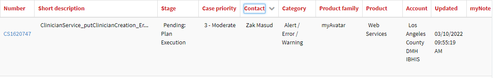
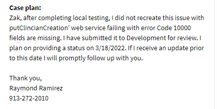
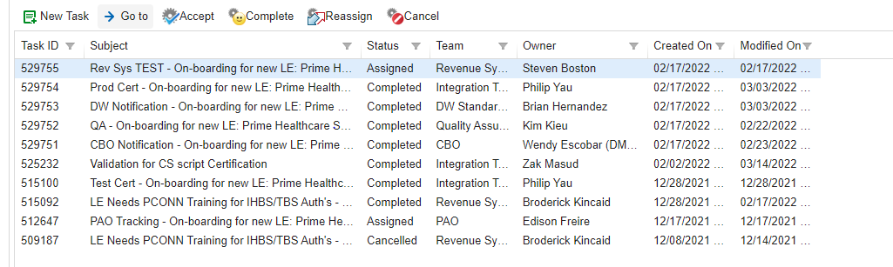

[[_TOC_]]

#Integration Services

# 1. Help Desk Tickets

::: query-table 8ec14279-1ee8-41ec-a4b5-b6d17000b5cb
:::

Oldest Ticket in queue is 515065 opened 12/28/21 \|Title: Test Cert ...

Tasks Assigned for Integration Team from Aug 1st to current in HEAT
systems.

| Category|                     No of Tickets |
|  --- | --- |
|  ACCESS                               |    2|
|  APPLICATION ERROR                 |       1|
|  CLAIM STATUS                     |        6|
| CONNECTION ISSUE                 |        1|
|  DOCUMENTATION                  |          3|
|  ERROR                         |           5|
|  FORM STATUS                  |            1|
|  GENERAL QUESTIONS           |             2|
|  INSTALLATION CERTIFICATE   |              4|
|  MEMBER AUTHORIZATION      |               1|
|  PRM DATA                 |                1|
| **Grand Total** | **27** |

Sharepoint link for full summary.

Salesforce Cases: 1

# 2. Maintenance & Operations 

## 2.1. Maintenance
- No current projects/modifications needed as part of maintenance

## 2.2. Operations

**Service Request #TBD**

**NAPPA Service Modification**

-   Changes are required to address additional fields (DEALicenseNumber, DEAExpirationDate) requested by stakeholders.

-   Additional fields must be added in order to complete EDI 274 testing with state.

**Project -- Active (EPSDT Dynamics/Service Integration)**

-   Team currently working with DMBI to migrate data to target environments by deployment dates. See Release Schedule portion of    BOB for deployment dates.

# 3. Currently Active Projects

**Project -- Active (LA County Healthcare Information Data Exchange --
HIDEx) -- Priority 1**

-   Microsoft team currently implementing baseline infrastructure to
    publish FHIR server and services

-   DMH provided security roles and memberships for subscriptions and
    RBAC access

-   DMH submitted requests for 9 subscriptions needed for HIDEx

-   Team working on publishing release via DevOps

-   Team documented requirements and ported to LA County instance of
    Azure DevOps

-   Microsoft onboarded two additional resources Paul Wu, Luis Fontanez

-   Microsoft team still missing two resources and runs risk of not
    meeting timeline due to lack of staffing

-   ~~Team was on hiatus due to holidays in late 2021~~

-   ~~Working internally to determined isolation, data, and privacy
    requirements~~

-   ~~Met with new Microsoft Architect Mustafa Al-Durra~~

-   ~~Confirmed new Architecture on 9/22/2021~~

-   ~~Requested diagrams from Microsoft on 9/24/2021~~

-   ~~Meetings planned for last week of Sept to begin planning of Sprint
    0.~~

-   ~~Scheduling sprint 0 activities and identifying resources~~

-   ~~Held meeting with Microsoft to discussion team activities,
    scheduling, and communication plan~~

-   

-   ~~Scheduling meeting with ISD to prepare Azure subscriptions~~

-   ~~Reference Architecture has been set and decided. Departments will
    share logical orchestration and separate functional storage.~~

-   ~~Inquiring with Microsoft next steps to begin Sprint 0~~

**Project -- Active (Netsmart -- FHIR Implementation) -- Priority 2**

-   Currently reviewing Change Notices to review, validate and include
    applicable logic from prior changes to Avatar Services

-   Currently meeting with Netsmart on weekly basis to review GAP
    analysis documents

-   ~~Began planning with Netsmart in late August.~~

-   ~~Met on 9/22/2021 for FHIR, Auth token, and demo~~

-   ~~Planning and scheduling the following sessions with Netsmart~~

    -   ~~Architectural and Workflow Discovery Planning Sessions~~

        -   ~~Four 3-4 hour sessions~~

    -   ~~Architecture and Workflow Focus Planning Sessions~~

        -   ~~Four 5 hour sessions~~

    -   ~~Quarterly FHIR Technical Support Sessions~~

        -   ~~Six 1-day (6 hours per session) per quarter~~

-   ~~Team is reviewing implementation guide provided by Netsmart~~

-   ~~ETA for feedback is week of 10/18/21~~

-   ~~Next session with Netsmart scheduled for Oct 27, 2021~~

-   ~~Working on finalizing GAP analysis for stakeholder review~~

-   ~~Gap analysis complete, will send to stakeholders for feedback~~

**Project -- Active (NACT EDI Integration) -- Priority 3**

-   Team is currently working on producing a test file for submission to
    DHCS

-   Access to state Sharepoint site is still pending

-   Requested XML validation response from State on 2/5/22. DHCS
    provided on 2/7/22

-   Met with DHCS on 2/4/22

-   ~~Project officially began 8/30/2021~~

-   ~~274 TR3 was not licensed by Department~~

-   ~~Worked with Administration to rush payment of invoice~~

-   ~~Invoice had been pending payment since September of 2020~~

-   ~~Received licensed TR3 on 9/24/21~~

-   ~~Design session scheduled 10/14/21~~

-   ~~Currently working on mapping dynamics entities to 274~~

-   ~~Developing logic app to build message and map to 274 schema~~

-   ~~Team had issue locating schema for state 274~~

-   ~~Team was able to resolve and is continuing to work on building 274
    message~~

-   ~~Team is currently mapping the 274 transaction~~

-   ~~At least 10 fields have been identified that are not captured in
    the source~~

-   ~~Development continues to build out the transaction as elements are
    mapped~~

-   ~~ETA for test file is mid-late January~~

# 4. Special Support 

## 4.1. In Progress

**Provider Merger - Active (Prime Health Care & St. Francis) -- Priority 6**

-   P-Auths generated on 10/18/21

-   Working with AppDev to on automated practitioner association solution

-   Team provisioned access to Prime Health & St. Francia as follows:

    -   Test certificate issued 12/28/2021

    -   Certification scripts completed on 2/10/2022

    -   Prime Health production cert issued 3/3/2022

    -   St. Francis production cert issued 10/5/2020 (expires 10/5/2022

    -   Ticket 404784 details onboarding handoffs:

> 

-   Meeting held on 3/8/2022 with Welligent regarding entity merger

**Program Implementation - Active (STARS Behavioral Health/CRTP) --
Priority 7**

-   Met with Ken Burnett, Jim Wallace, Daniel Navasartian and William
    Hubbard to discuss CRTP configuration

-   CRTP program will leverage 24Hr admissions. Program will span
    multiple legal entities. 24Hr admissions will be submitted under the
    overarching legal entity

-   Will G. (Revenue Systems) and Giri P (Enterprise App) provided    insight on billing and program config

-   Two new LE's will be forming under contract -- Central Stars, Valley
-    Stars will need new certs once DUNS is established.

**Private Insurance Billing Implementation -- Active -- Priority 8**

-   Provided ACH ACCL form detailing contacts for DMH on 2/27/22, TTC confirmed receipt on 2/17/22

-   TTC forwarded ACCL request to Bank of America on 3/15/22

-   TTC is currently working on scripts to facilitate transfer from Bank
    of America.

**ECM Data Exchange Implementation - Active -- Priority 9**

-   Continuing to meet and discuss ECM/ILOS service implementation with
    LACare

-   Per Yvette Willock data exchanges must be established with the
    following Health Plans:

    -   L.A. Care

    -   Health Net

    -   Anthem

    -   Blue Shield of California, Promise Health Plan

    -   Molina

-   Working with Project Management to document the program and project
    requests

## 4.2. In Queue**

## 4.3. In Analysis**

-   Enterprise Service Bus -- Juan F.

    -   Access to Care (MicroSvc) -- Moh

    -   SRTS -- CSI Integration -- Zak

    -   Potential Client (MicroSvc) -- Zak

-   Noridian (Fed 837) Automation -- Mohammed

-   Update Client Push (Race/Ethnicity) -- Zak

-   Day Treatment Authorization Service -- Philip

-   Appointment/Referral -- TBD

-   270/271 Real Time Medical Eligibility -- Philip

## 4.4. Approved Projects - Not started**

-   BizTalk Health Check Remediation -- TBD

# 5. Integration Release Schedule: 

EPSDT: TST: February 25th, 2022 / QA: April 27th, 2022 / PROD: May 11th,
2022

Scriptlink: SBOX: February 22, 2021 / PROD: TBD

## 5.1. LE Onboarding Status 

Sharepoint link here.

## 5.2. FFS Onboarding Status

Sharepoint link here.

# 6. On HOLD (Items in this section will remain static until re-activated) 

**Project -- Subscription consolidation (Azure Gov & Commercial) --
Priority 4**

-   Provided list of resources to DMBI, App Dev and Int on 8/30/21

-   Began inventory of resources left on DMH's legacy subscription

-   Working with ISD to implement commercial subscription

-   Provided access to App Dev resources

**Project -- Subscription Organization and Ratification (Azure Gov &
Commercial) -- Priority 5**

-   Met with Mark Cheng and John Ortega 11/2/21

-   Integration to work with DMBI to produce organization proposal for
    Mark and John's approval

**Service Request #746538 -- Not Started/Planning**

**SRL Service Modification**

-   Per request received on 2/8/21 -- SRL service requires modification

-   Team currently assessing implementation effort

-   Preliminary analysis determined public service definition requires modification

-   Changes estimated at approximate 6 weeks

-   Requirements gathering in process -- Team waiting for confirmation
from stakeholders on rules.

-   Next steps to confirm all requirements and acceptance criteria and
 begin development.

-   Development put on hold pending solution architecture of SRTS integration

-   Meeting to discuss ~~4/27/2021~~ Meeting was cancelled and has not been rescheduled

-   Working with App Dev to discuss approach and solution

**Project -- Active (BizTalk Azure Migration) -- Cancelled**

-   This effort is no longer needed as HIDEx/IPaaS will replace the
    BizTalk on-prem functionality

-   ~~Team has implemented Vnet, subnets, Network security groups, and
    VMs~~

-   ~~Developed Azure Resource Management Templates for deployment of
    resources~~

-   ~~In process of Working with Security and Shared Services teams to
    deploy ARM template and validate access permissions~~

-   ~~ISD Security to provide feedback on ARM templates -- requested
    update on 12/16/20~~

-   ~~Meeting scheduled for 12/17/20~~

-   ~~ISD reviewing/processing proposed changes -- Review has been
    pending 3 weeks~~

-   ~~Update requested 1/7/2021~~

-   ~~Request for update escalated on 1/13/2021~~

-   ~~Azure ARM templates stalled due to ISD security review~~

-   ~~Team has not been able to get feedback from ISD security since Nov
    2021~~

-   ~~Escalating to ISD Management~~

-   ~~ISD requesting that all traffic be routed to ISD data center~~

-   ~~DMH team discussed with Microsoft and neither agrees traffic
    should be routed to ISD prior to Azure.~~

-   ~~Requires discussion with ISD and escalation with DMH.~~

-   ~~Integration team escalated with DMH Security. Working on diagram
    and documentation for discussion.~~

-   ~~Next steps to escalate with ISD Manager Rumi Salihue~~

**ITAM**

-   Use ITAM to track division assets and configuration

-   Melvin M to setup a meeting to demo

-   Follow up email sent to Melvin on 1/29/20

-   Demo scheduled for 2/13/20

-   Discussed necessary data for ITAM pilot

-   DevOps currently working on providing extract for load to ITAM

-   Draft extract provided to 5/14/20

-   Resuming Activity 9/9/20

-   EDI work put on hold to accommodate Client Services change deployed
    9/18/20

-   CS deployments to TST, QA, and Prod completed

-   EDI work resumed and currently testing application

-   Team working out issues with test Trading Partners

**VSee**

-   Telepsych solution, currently conducting discovery in partnership
    with Project Delivery

-   Requested documentation on 7/15/20, 7/22/20

-   No Documentation received as of ~~7/29/20~~, ~~8/5/20 8/12/20~~

-   Sent updated request for documentation on ~~8/12/20~~ 8/27/20

-   Requested update ~~10/8/20~~, 10/20/20

-   Technical documentation has not been provided as of 10/20/20,
    despite several requests.

# 7. Recently completed (Items in this section are removed once reviewed) 

**Service Request #746493**

**EPSDT Service Modification**

-   All service changes are complete -- working on deployments.

**Project -- Completed (Scriptlink Integration) -- Priority 4**

-   Service modifications complete -- working on deployments. See
    Release Schedule portion of BOB for deployment dates.

-   ~~Three uses cases defined by Informatics~~

-   ~~Documented processes for use cases~~

-   ~~Defined preliminary architecture~~

-   ~~ARM templates developed and tested~~

-   ~~DevOps pipelines being developed~~

-   ~~Current issue with DCI Import service~~

    -   ~~Service is not available outside of DMH network~~

    -   ~~Options are to:~~

        -   ~~Abstract DCI with BizTalk interface~~

        -   ~~Implement necessary networking between Azure and DCI
            Import service~~

**MDM Environment Migration - Completed -- Priority 10**

-   Migration of Production, Test, and Dev environments completed on
    1/18/2022.

-   Decommission of legacy servers completed in January 2022. Billing to
    stop in Feb 2022.

**Provider Merger -- Completed (Pacific Clinics & Uplift) -- Priority 7**

-   Team has implemented necessary profiles for new entity.

-   Production certs validated 3/16/22

-   Welligent ran scripts to create admissions for migrating clients to
    LE00120 on 3/16/22.

-   Merger completed 3/1/22
